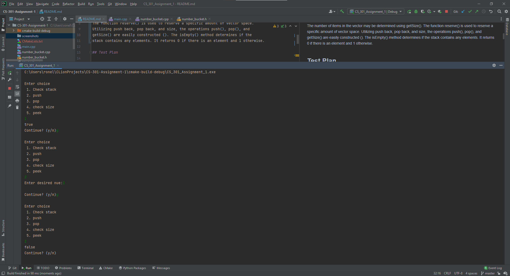
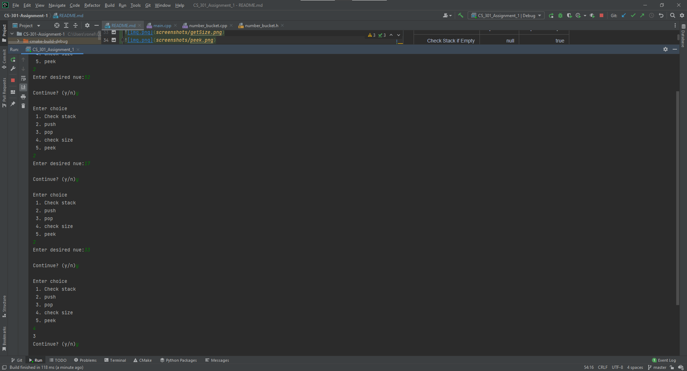
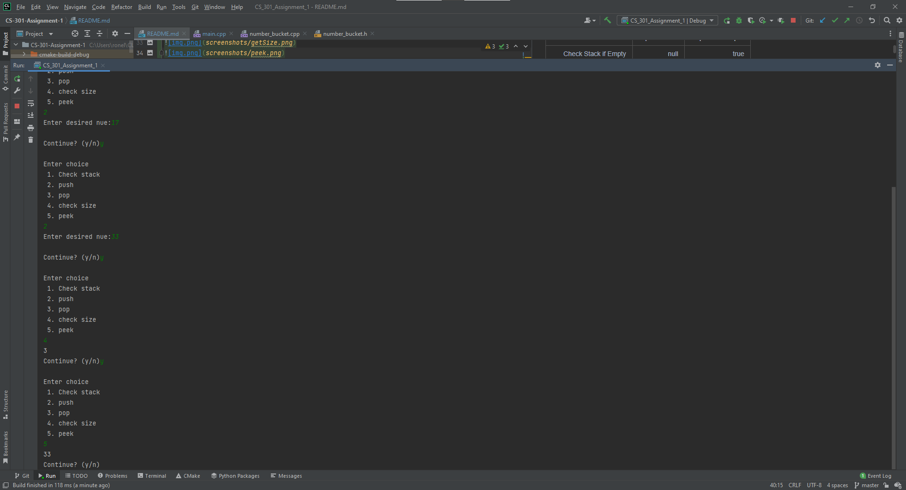

# CS 301 Assignment 1
Study Group 7 (Alex Milanez, John Edwin Karel Delgado, Ronell Sean Rulloda)

#
## Project Plan

The number of items in the vector may be determined using getSize(). 
The function reserve() is used to reserve a specific amount of vector space. 
Utilizing push back, pop back, and size, the operations push(), pop(), and 
getSize() are easily constructed (). The isEmpty() method determines if the 
stack contains any elements. It returns 0 if there is an element and 1 otherwise.

## Test Plan

|     Reason for Test Case |   Input Values | Expected Output |
|-------------------------:|---------------:|----------------:|
|     Check Stack if Empty |           null |            true |
| Check Stack if not Empty |              1 |           false |
|                  GetSize |     52, 17, 33 |               3 |
|                     Peek |     52, 17, 33 |              33 |

Functions planned to implement:
* void push(int n);
* int pop();
* int peek();
* bool isEmpty();
* int getSize();

#
## Output Screenshots

